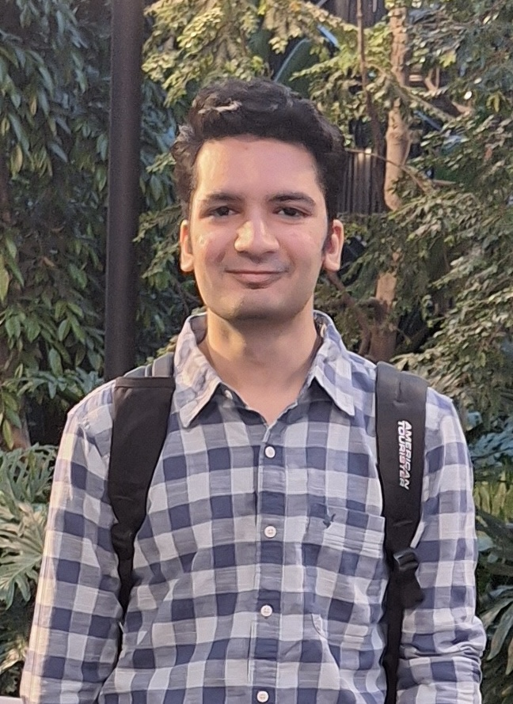

<link rel="stylesheet" href="https://cdnjs.cloudflare.com/ajax/libs/font-awesome/4.7.0/css/font-awesome.min.css">

<div style="display: flex; justify-content: space-between; flex-wrap: wrap;">
  <div>
      <h1>Sambhav Khanna</h1>
      Computer Science @ UWaterloo
      <br>
      Faculty of Mathematics
      <br>
      he/him
      <br>
      <br>
      <a href="mailto:sambhav.khanna@uwaterloo.ca">sambhav.khanna@uwaterloo.ca</a>
      <br>
      <br>
      <div style="display: flex; justify-content: space-between; flex-wrap: wrap;">
          <div>
              <a href="http://github.com/sambhavKhanna"><i aria-hidden="true" title="GitHub"
                      class="fa fa-github fa-2x"></i> </a>
          </div>
          <div>
              <a href="https://www.linkedin.com/in/sambhav-khanna/"><i aria-hidden="true"
                      title="LinkedIn" class="fa fa-linkedin fa-2x"></i> </a>
          </div>
          <div>
              <a href="https://twitter.com/khsambhav"><i aria-hidden="true"
                      title="X" class="fa fa-twitter fa-2x"></i> </a>
          </div>
      </div>
      <br>
      <br>
      <div style="display: flex; justify-content: space-between; flex-wrap: wrap;">
          <div>
            <a href="resume.pdf">resume</a>
          </div>
          <div>
              <a href="experience">experiences</a>
          </div>
          <div>
              <a href="projects">projects</a>
          </div>
      </div>
      <br>
      <div style="display: flex; flex-wrap: wrap;">
          <div style="margin-right: 15px;">
            <a href="courses">courses</a>
          </div>
          <div>
              <a href="artwork">artwork</a>
          </div>
      </div>
  </div>
  <div>
    <figure class="header__photo-wrapper">
        
    </figure>
  </div>
</div>

<!--  -->
```poetry
Welcome!
```
👋 Hi, my name is Sambhav Khanna and I'm a third-year student at the **University of Waterloo**, majoring in **Computer Science**, with a specialization in Artificial Intelligence, and **expected to graduate in the Spring of 2027**. The details of the courses I have taken so far can be found at, [[courses|courses]].

💻 I'm proficient in full-stack development, leveraging Python, Node.js, C, and C++ for back-end applications, Next.js and Streamlit for front-end design, Postgres SQL, MongoDB and Firebase for database management, and Vercel, Google Cloud, AWS, and Azure for cloud hosting!

⭐ I'm enthusiastic about Software Development and recently I have been learning about LLMs, RAG systems, agentic systems and how AI integrated software is developed. I have used various opensource LLM APIs that I have brought locally to my machine using Ollama and Docker. I have also worked with multi-modal LLM APIs including Gemini 1.5 Pro, GPT-4-turbo. The details of the projects I have made so far can be found at, [[projects|projects]].

💼 I have successfully completed two internships so far and currently interning at Radical AI as a SWE intern, working on their AI agent. I'm working with Next.js and Python, developing their function calling pipeline. The complete details of my work experiences can be found at, [[experience|experiences]].

✍️ In my free time, I like to sketch, paint, play badminton and listen to rap (J Cole is the 🐐). I also enjoy participating in hackathons and building creative solutions to everyday problems. Some of my artwork can be found at, [[artwork|artwork]].

📖 In my final year at highschool, I competed in the Joint Entrance Exam(JEE) Mains and Advanced, which are admission tests for the Indian Institute of Technology(IIT). I received a rank of 3,890 out of 1,026,799 (in top 0.43%) in JEE Mains and a rank of 5,161 out of 155,538 (in top 3.3%) in JEE Advanced, getting selected into IIT Kharargpur for Mechanical Engineering.

I had a final average of 97% in highschool in a total of 5 subjects and, receieved President's Scholarship and International Mathematics Scholarship worth a total of 25,000 CAD by the University of Waterloo.

If you want to know more about me or want to share something interesting, feel free to reach out to me at sambhav.khanna@uwaterloo.ca.

```poetry
- Sambhav :)
```
