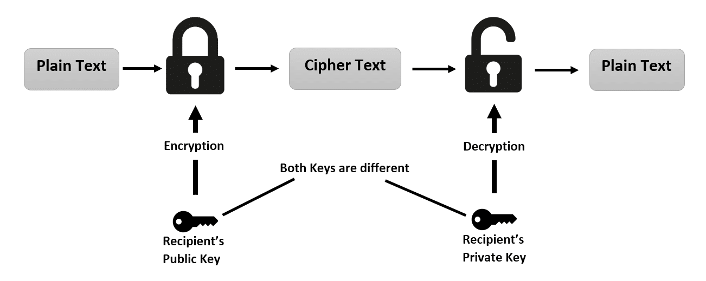

<link rel="stylesheet" href="https://cdnjs.cloudflare.com/ajax/libs/font-awesome/4.7.0/css/font-awesome.min.css">

**Quantity is the journey to quality**

 

    
    <h3>Multi Modal Chatbot</h3>
     
    

        

            llava-phi3 model
        

        

            Streamlit
        

        

            Ollama
        

    

    
A Multi modal chatbot made using llava-phi3 model, pulled locally using Ollama. The UI is made using Streamlit.

    <a href="http://github.com/sambhavKhanna"><i aria-hidden="true" title="GitHub"
        class="fa fa-github fa-2x"></i> </a>

    
    <h3>Multi Layer Perceptron</h3>
     
    

        

            Python
        

        

            Pytorch
        

        

            graphviz
        

    

    
A Multi Layer Perceptron made from scratch, the implementation is similar to Pytorch. Implemented backpropagation and gradient descent algorithms.

    <a href="http://github.com/sambhavKhanna"><i aria-hidden="true" title="GitHub"
        class="fa fa-github fa-2x"></i> </a>

    
    <h3>Face Mash 2.0</h3>
     
    

        

            C++
        

        

            HTML
        

        

            Bash
        

    

    
Inspired by Mark Zukerberg's Face Mash, I made a shell script to download html pages of provided urls. Implemented a html parser in C++ to download the images from the links provided in the html.

    <a href="http://github.com/sambhavKhanna"><i aria-hidden="true" title="GitHub"
        class="fa fa-github fa-2x"></i> </a>

    
    <h3>SolGPT</h3>
     
    

        

            Solana web3
        

        

            JavaScript
        

    

    
A ChatGPT plugin used to interact with the Solana blockchain. It can access the account balance, NFTs owned and transaction history provided a public key.

    <a href="http://github.com/sambhavKhanna"><i aria-hidden="true" title="GitHub"
        class="fa fa-github fa-2x"></i> </a>

    
    <h3>ChatrBox</h3>
     
    

        

            React.js
        

        

            MongoDB
        

        

            socket.io
        

        

            Express.js
        

    

    
A chat app inspired by Whatsapp, made using MERN stack and containerized using Docker. The application is deployed on AWS EC2.

    <a href="http://github.com/sambhavKhanna"><i aria-hidden="true" title="GitHub"
        class="fa fa-github fa-2x"></i> </a>

    
    <h3>SkillSync</h3>
     
    

        

            MongoDB
        

        

            React.js
        

        

            Express.js
        

        

            Recoil.js
        

    

    
A course selling app, made using MERN stack and using   Recoil.js for state management.

    <a href="http://github.com/sambhavKhanna"><i aria-hidden="true" title="GitHub"
        class="fa fa-github fa-2x"></i> </a>

    
    <h3>PyPredict</h3>
     
    

        

            Python
        

        

            Numpy
        

        

            Pandas
        

    

    
The model uses historical stock price data to train polynomial regression models and predict future stock prices. The models' accuracy is evaluated using R-squared values.

    <a href="http://github.com/sambhavKhanna"><i aria-hidden="true" title="GitHub"
        class="fa fa-github fa-2x"></i> </a>

    
    <h3>RSA Encryption</h3>
     
    

        

            Python
        

    

    
 Implemented a simple encryption and digital signature scheme using Python. The code defines a set of functions that allow a user to encrypt and decrypt messages, generate individual keys for encryption, and create digital signatures for messages using a public-private key pair.

    <a href="http://github.com/sambhavKhanna"><i aria-hidden="true" title="GitHub"
        class="fa fa-github fa-2x"></i> </a>

 

